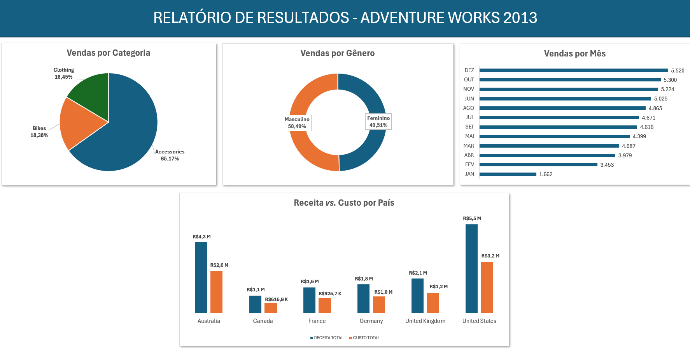

# 📊 Inteligência de Vendas Online: Dashboard de KPIs para Decisão Comercial
Análise da performance de vendas do canal Internet (AdventureWorks) com SQL Server + Excel.


> Projeto que transforma dados brutos de vendas em um painel de indicadores comerciais capaz de apoiar decisões sobre catálogo, sazonalidade, mercados prioritários e perfil de cliente — do banco de dados ao dashboard, usando T-SQL e Excel + Power Query.

---

## 📑 Sumário

- [Sobre o Projeto](#-sobre-o-projeto)
- [KPIs Desenvolvidos](#-kpis-desenvolvidos)
- [Preview do Dashboard](#️-preview-do-dashboard)
- [Tecnologias Utilizadas](#️-tecnologias-utilizadas)
- [Estrutura do Repositório](#-estrutura-do-repositório)
- [Como Reproduzir](#️-como-reproduzir)
- [Principais Insights](#-principais-insights)
- [Autor](#-autor)

---

## 📌 Sobre o Projeto

Este projeto simula um cenário real de análise de negócio para uma empresa de varejo online, utilizando o banco de dados de exemplo **AdventureWorks** (Microsoft) para o ano de 2013. O objetivo foi transformar dados brutos de vendas do canal *Internet Sales* em indicadores de negócio (KPIs) claros e acionáveis, apresentados em um dashboard interativo no Excel.

O fluxo do projeto segue uma pipeline típica de BI:

**SQL Server (extração e modelagem)** → **T-SQL (cálculo dos KPIs)** → **Power Query (conexão)** → **Excel (visualização e dashboard)**

### 🎯 Objetivo

Praticar e demonstrar habilidades essenciais de análise de dados:
- Escrita de consultas SQL para responder perguntas de negócio específicas
- Modelagem de indicadores (KPIs) relevantes para times comerciais
- Conexão de fontes de dados relacionais ao Excel via Power Query
- Construção de dashboards claros, visuais e de fácil leitura

---

## 📈 KPIs Desenvolvidos

| # | KPI | Pergunta de Negócio Respondida |
|---|-----|----------------------------------|
| 1 | **Total de Vendas Internet por Categoria** | Quais categorias de produto mais vendem no canal online? |
| 2 | **Receita Total Internet por Mês do Pedido** | Como a receita evolui ao longo do tempo? Há sazonalidade? |
| 3 | **Receita e Custo Total Internet por País** | Quais mercados geram mais receita e qual a margem por região? |
| 4 | **Total de Vendas Internet por Sexo do Cliente** | Existe diferença de comportamento de compra entre os perfis de cliente? |

Cada KPI foi validado primeiro por um script SQL individual na pasta [sql](./sql), etapa de análise exploratória que antecedeu a criação de uma VIEW consolidando todos os dados necessários para a análise no Excel.

Essa VIEW serviu como fonte única de dados: no Excel, ela foi explorada com tabelas dinâmicas — o equivalente visual da cláusula GROUP BY do SQL — a partir das quais foram construídos os gráficos do dashboard.

---

## 🖼️ Preview do Dashboard



---

## 🛠️ Tecnologias Utilizadas

- **SQL Server** — armazenamento e modelagem dos dados (AdventureWorks)
- **T-SQL** — extração e transformação dos KPIs
- **Excel + Power Query** — conexão com o banco, transformação e dashboard
- **Tabelas Dinâmicas / Segmentações (Slicers)** — interatividade no dashboard
- **Git & GitHub** — versionamento e portfólio

---

## 📂 Estrutura do Repositório

```
adventureworks-sql-excel-dashboard/
├── sql/
│   ├── VIEW_analise_KPIs.sql
│   ├── receita_e_custo_internet_por_país.sql
│   ├── receita_internet_por_mes_pedido.sql
│   ├── total_vendas_internet_por_genero_cliente.sql
│   └── vendas_internet_por_categoria.sql
├── excel/
│   └── Dashboard_AdventureWorks2025.xlsx
├── docs/
│   └── images/
│       └── dashboard_adventureworks.png
├── README.md
└── LICENSE
```

---

## ⚙️ Como Reproduzir

1. Baixe e restaure o banco **AdventureWorksDW2025**  a partir do [repositório oficial da Microsoft](https://github.com/Microsoft/sql-server-samples/releases).
2. Execute os scripts da pasta 'sql' no SQL Server Management Studio (SSMS) para validar os KPIs.
3. Abra o arquivo [Dashboard_AdventureWorks2025](./excel) no Excel.
4. Em **Dados > Consultas e Conexões**, atualize a string de conexão para apontar para a sua instância local do SQL Server.
5. Clique em **Atualizar Tudo** para carregar os dados e explore o dashboard.

---

## 💡 Principais Insights

- A categoria **"Accessories"** representa a maior parcela da receita Internet, com destaque para o período de **Out-Dez e Jun-Ago**.
- **"United States"** apresenta a maior margem (receita − custo) e maior volume, enquanto **"Canada"** tem menor volume e menor margem.
- O perfil de cliente **"Masculino"** concentra **50,49%** das vendas online, sugerindo oportunidade de campanhas direcionadas, embora a diferença para o perfil **"Feminino"** seja proporcionalmente bem pequena.

---

## 👤 Autor

<div align="center">
<table>
  <tr>
    <td align="center">
      <b>Otávio Fabbro Machado</b><br/>
      Bacharel em Ciências Sociais (FFLCH-USP)<br/>
      Especialista em Ciência de Dados (ICMC-USP)<br/><br/>
      <a href="https://www.linkedin.com/in/otaviofabbrodata">
        
      </a>
      <a href="https://github.com/otaviofabbro">
        
      </a>
      <a href="mailto:otaviofabbro2@gmail.com">
        
      </a>
    </td>
  </tr>
</table>

</div>

---

## 📄 Licença

Este projeto está sob a licença MIT — veja o arquivo [LICENSE](./LICENSE) para mais detalhes.

